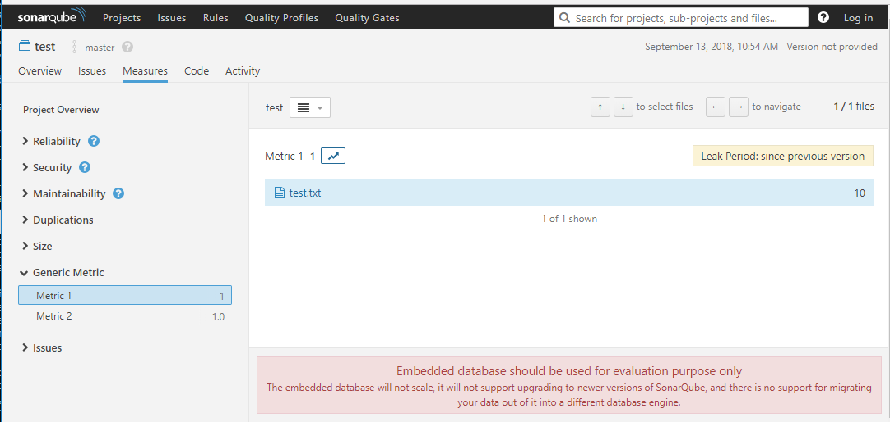

# Sonar Generic Metrics

SonarQube Plugin to publish any metrics based on a JSON file. 


# Status

| | |
| --- | --- |
| **Build** | |
| **Coverage** | [](https://codecov.io/gh/ericlemes/sonar-generic-metrics) |


# How to use

SonarQube has the scanner side and the server side and the setup needs to happen on both sides.

## Server Side (Compute Engine side)

Create a json file with this following structure:

```json
{
	"metrics": [{
			"key": "metric1",
			"name": "Metric 1",
			"type": "INT",
			"description": "Description Metric 1",
			"direction": -1,
			"qualitative": false,
			"domain": "Generic Metric"
		},
		{
			"key": "metric2",
			"name": "Metric 2",
			"type": "FLOAT",
			"description": "Description Metric 2",
			"direction": 0,
			"qualitative": false,
			"domain": "Generic Metric"
		}
	]
}
```

These will be the metrics registered by the server during server startup. You can register as many as you want, but bear in mind that they will all be registered in one go. If you have more than one project scanner by SonarQube that uses different metrics, on the server side, they all needs to be together. For example, if Project 1 uses Metric 1 and Project 2 uses Metric 2, your json file on server side must have all the metrics in a single file.

The metric ***key*** is very important. This is an unique identifier for your metric and must not clash with any other existing metric. 

Next step is to deploy this file on your server and create an environment variable pointing to that file, for example

```
SONAR_GENERIC_METRICS_JSONDATA=c:\full\path\to\my\metrics.json
```

The file must be accessible by the user that runs your server process.


## Scanner side

On your scanner, you will have to generate a json file with the data that you would like to publish. For example:

```json
{
	"measures": [{
			"metric-key": "metric1",
			"file": "test.txt",
			"value": 10
		},
		{
			"metric-key": "metric2",
			"file": "path\\related\\to\\root\\scan\\anotherfile.txt",
			"value": 1.5
		}
	]
}
```

Then when running our Sonar Scanner, add the following property:
```
sonar.generic.metrics.jsondata=path\to\your.json
```

## Result

In your SonarQube instance, you will see something similar to:




# Limitations

- Only INT and FLOAT metric types supported.
- The metrics will be displayed in the "Measures" tab of SonarQube. No other kinds of metrics are supported
